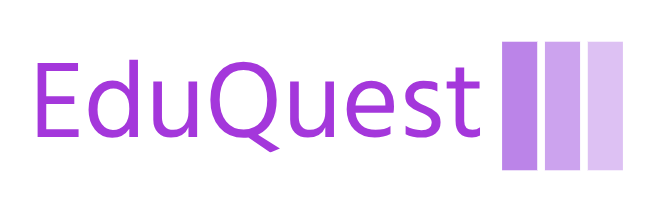

# EduQuest - An E-Learning Platform

Welcome to EduQuest, your go-to platform for online learning!

## Table of Contents
- [Introduction](#introduction)
- [Features](#features)
- [Testimonials](#testimonials)
- [Pricing](#pricing)
- [What We Offer](#what-we-offer)
- [Contributions](#contributions)
- [How to Use](#how-to-use)
- [Footer](#footer)

## Introduction

This landing page showcases the features and offerings of EduQuest, an E-Learning Platform designed to unlock your potential through online learning.

## Features

### Wide Range of Courses
Explore diverse subjects with our extensive collection of online courses.

### Interactive Learning
Engage with interactive content and quizzes to reinforce your learning.

### Flexible Schedule
Learn at your own pace with 24/7 access to course materials.

## Testimonials

See what our students have to say about their EduQuest experience:

- "I love the variety of courses available. The interactive learning experience is fantastic!" - John Doe
- "The flexibility to learn at my own pace has made a significant difference in my education." - Jane Smith

## Pricing

Choose the plan that suits you best:

1. **Basic Plan**
   - Access to Basic Courses
   - Limited Quizzes
   - 24/7 Email Support
   - Price: Rs. 299/month

2. **Standard Plan**
   - Access to Standard and Premium Courses
   - Interactive Learning
   - 24/7 Email Support
   - Access to All Quizzes
   - Price: Rs. 599/month

3. **Premium Plan**
   - Access to All Courses
   - Interactive Learning
   - Unlimited Quizzes
   - Priority Email Support
   - Personal Tutor
   - Price: Rs. 799/month

## What We Offer

1. **Expert Instructors**
   - Learn from industry experts with real-world experience.

2. **Cutting-Edge Content**
   - Access up-to-date and relevant course content to stay ahead.

3. **Hands-On Projects**
   - Apply your knowledge with hands-on projects and assignments.

## How to Use

1. **Clone the Repository:**

2. **Open the HTML File:**
- Navigate to the cloned directory.
- Open the `index.html` file in your preferred web browser.

3. **Explore and Customize:**
- Explore different sections of the landing page.
- Customize the content, images, and styles to fit your platform.

## Contributions

Contributions are welcome! If you'd like to contribute to this project, please open an issue or a pull request.

## Footer

&copy; 2023 EduQuest - An E-Learning Platform. All rights reserved. | [Privacy Policy](#) | [Terms of Service](#)

##
**Author:** Mangesh Pangam  
**GitHub:** [Mangesh2704](https://github.com/Mangesh2704)  
**Email:** 202103036.mangeshpkr@student.xavier.ac.in
