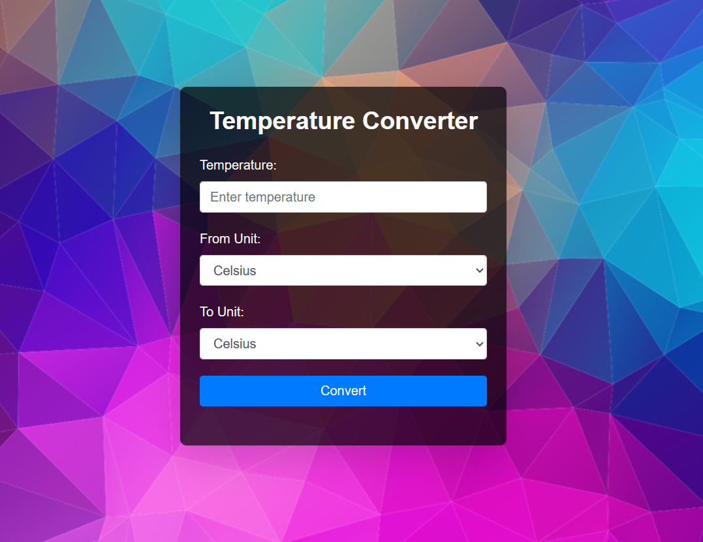

# Temperature Converter Website

This is a simple web-based temperature converter that allows users to convert temperatures between Celsius, Fahrenheit, and Kelvin.

## Features

- Convert temperatures between Celsius, Fahrenheit, and Kelvin.
- Responsive and user-friendly interface.
- Real-time temperature conversion.

## Preview



## Getting Started

To use the Temperature Converter, follow these steps:

1. Clone the repository:

   ```bash
   git clone https://github.com/your-username/temperature-converter.git

2. Open the index.html file in your web browser.

3. Enter the temperature in the input field, select the "From" and "To" units, and click the "Convert" button.

4. The converted temperature will be displayed below the button.

## Technologies Used

1. HTML
2. CSS (Bootstrap and Tailwind CSS)
3. JavaScript

## Usage
1. Open index.html in your preferred web browser.
2. Enter the temperature in the input field.
3. Select the "From" and "To" units from the dropdowns.
4. Click the "Convert" button to see the converted temperature.

## Contributions

Contributions are welcome! If you'd like to contribute to this project, please open an issue or a pull request.

##
**Author:** Mangesh Pangam  
**GitHub:** [Mangesh2704](https://github.com/Mangesh2704)  
**Email:** 202103036.mangeshpkr@student.xavier.ac.in
