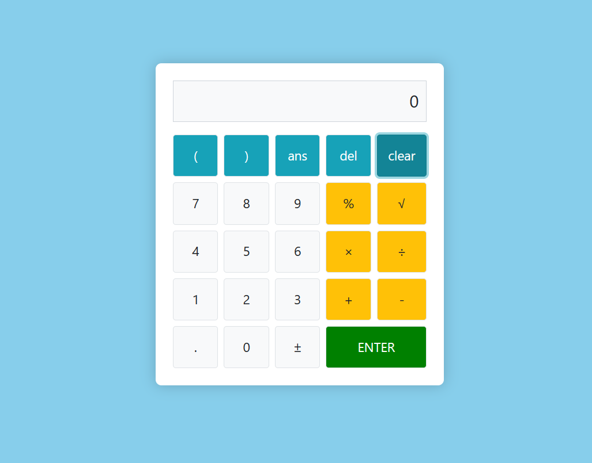

# Calculator Web App



A simple calculator web application built using HTML, CSS, and JavaScript.

## Features

- Basic arithmetic operations: addition, subtraction, multiplication, division.
- Percentage calculation (%).
- Square root (√) functionality.
- Ans button to recall the last result.
- Delete (Del) button to remove the last character.
- Clear (C) button to clear the input.
- Responsive design for various screen sizes.

## How to Use

1. Clone the repository:

   ```bash
   git clone https://github.com/your-username/calculator-web-app.git

2. Open `index.html` in your web browser.

3. Start calculating!

## Contributions

Contributions are welcome! If you'd like to contribute to this project, please open an issue or a pull request.

##
**Author:** Mangesh Pangam  
**GitHub:** [Mangesh2704](https://github.com/Mangesh2704)  
**Email:** 202103036.mangeshpkr@student.xavier.ac.in
