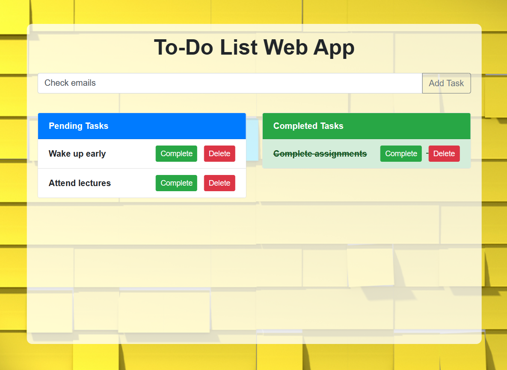

# To-Do Web App

This is a simple to-do web app that enables users to add daily tasks. Users can add new items to a list, mark tasks as "complete," and view completed tasks in a separate list. The app also provides a section for pending tasks, which is a union of pending and completed tasks.

## Features

- Add new tasks to the to-do list.
- Mark tasks as "complete."
- View pending tasks and completed tasks separately.
- Delete tasks from the list.

### Additional Features

- Date and time tracking for task addition and completion.

## Preview



## How to Use

1. Clone the repository:

    ```bash
    git clone https://github.com/your-username/to-do-web-app.git
    ```

2. Open the `index.html` file in your web browser.

3. Start adding tasks!

## Technologies Used

- HTML
- CSS
- Bootstrap
- JavaScript

## Styling

The app features a clean and responsive design. The to-do list is presented in a two-column layout, with pending tasks on the left and completed tasks on the right. The background image adds a touch of personalization.

## Contributions

Contributions are welcome! If you'd like to contribute to this project, please open an issue or a pull request.

##
**Author:** Mangesh Pangam  
**GitHub:** [Mangesh2704](https://github.com/Mangesh2704)  
**Email:** 202103036.mangeshpkr@student.xavier.ac.in
