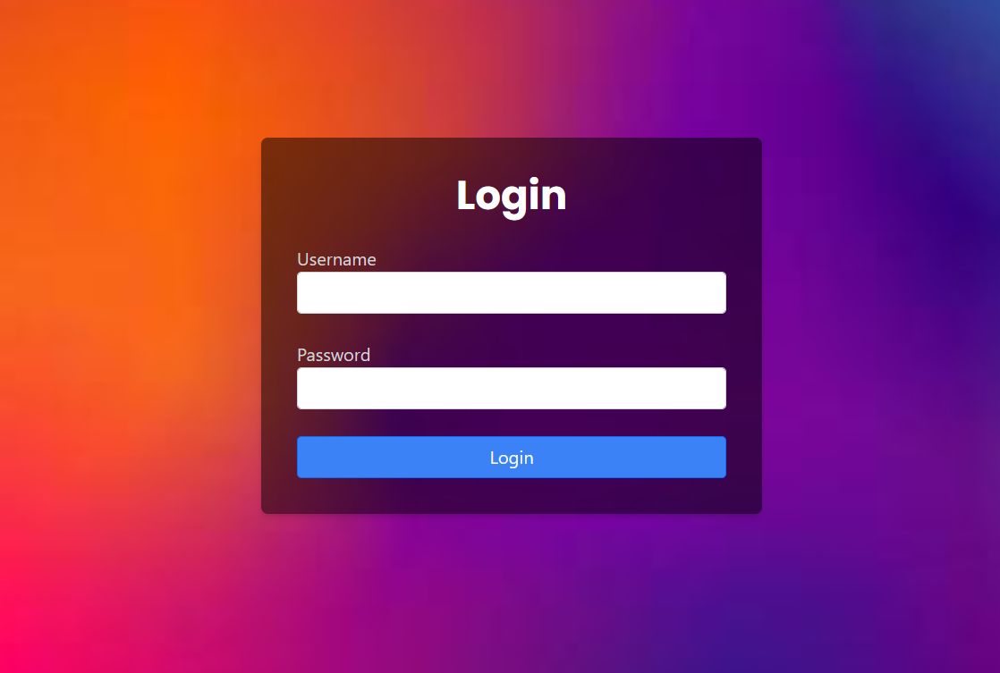

# Login Authentication System

A simple login authentication system with a secured page using HTML, CSS (Bootstrap and Tailwind CSS), and JavaScript.

## Preview



## Table of Contents

- [Prerequisites](#prerequisites)
- [Getting Started](#getting-started)
- [Files and Structure](#files-and-structure)
- [Usage](#usage)
- [Contributions](#contributions)

## Prerequisites

Before you begin, ensure you have the following installed:

- Web browser

## Getting Started

Follow these steps to run the login authentication system:

1. Clone the repository:

   ```bash
   git clone <repository-url>

2. Open `index.html` in your web browser

3. Enter valid credentials in the login form (e.g., username: demo, password: password) and click the "Login" button.

4. After successful login, you will be redirected to the secured page.

## Files and Structure

1. `index.html`
- This file contains the login form with Bootstrap and Tailwind CSS styles.

2. `secured.html`
- The secured page displayed after successful login.

3. `auth.js`
- JavaScript file handling authentication. It validates whether the user is authenticated. If not, it redirects to the home page.

4. `init.js`
- JavaScript file initializing authentication and handling logout functionality.

5. `login.js`
- JavaScript file for form validation and login functionality.

## Usage

1. Open `index.html` and input valid credentials.
2. Navigate to the secured page after successful login.
3. Click on the "Log Out" link to log out and return to the login page.

## Contributions

Contributions are welcome! If you'd like to contribute to this project, please open an issue or a pull request.

##
**Author:** Mangesh Pangam  
**GitHub:** [Mangesh2704](https://github.com/Mangesh2704)  
**Email:** 202103036.mangeshpkr@student.xavier.ac.in
